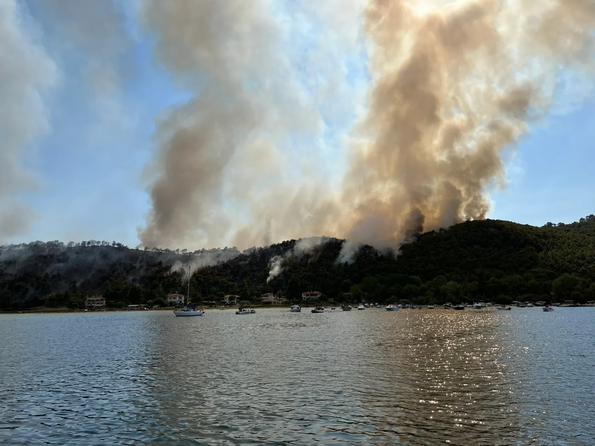
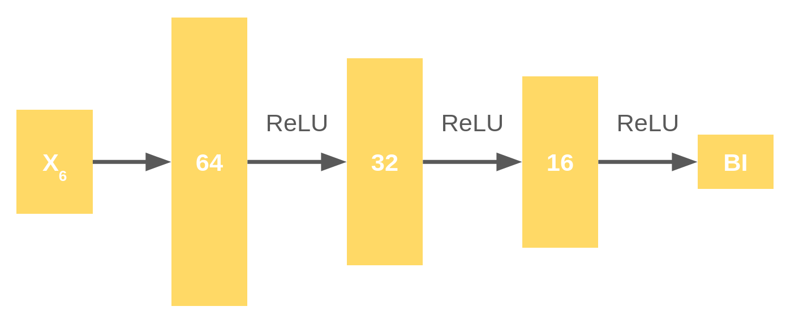
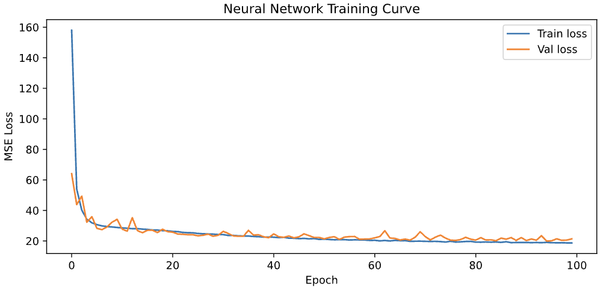

# Motivation

## Why Wildfires?


Climate change is one of those really big issues that everyone agrees needs to be solved but no one knows how to. So we started looking for topics and datasets where we could perform some meaningful analysis to mitigate some of its impacts. And so we found a comprehensive wildfire dataset.

While many of us tend to think of climate change as a distant issue, this hits close to home. The image below is from a 2025 wildfire in Chalkidiki Greece that was just 300 yards away from the cottage house Filip's grandparents built.

<!-- https://www.keeptalkinggreece.com/2025/07/02/halkidiki-vourvoourou-wildfire-village-forest/ -->



## Understanding Wildfires

First, what *is* a wildfire? According to [EPA](https://www.epa.gov/wildfires/wildland-fires-and-public-health-effects):

> A wilfire is "[A]ny fire started by an unplanned ignition [...]; unauthorized activity; or accidental, human-caused actions, or a prescribed fire that has developed into a wildfire." [1]

Wildfires are pertinent to our research because, as [USGS](https://www.usgs.gov/faqs/will-global-warming-produce-more-frequent-and-more-intense-wildfires) explains, there is "general consensus that fire occurrence will increase with climate change." Nevertheless, despite climate change worsening wildfires, [NIFC](https://www.nifc.gov/fire-information/statistics) data shows that in 2024, the majority of wildfires, 57,962 to be exact, were ignited by humans (especially California) with only 6,935 fires attributed to natural causes (most common in Alaska).


## Wildfire Impacts

, [b](
https://www.vecteezy.com/vector-art/23880460-cost-reduction-vector-illustration-with-decrease-price-minimising-or-falling-rate-of-profit-in-business-flat-cartoon-hand-drawn-templates), [c](https://www.dreamstime.com/illustration/outage-rgb-color-icon.html) and [d](
https://www.freepik.com/free-photos-vectors/water-scarcity-illustration).](./images/wildfire_impacts.png){width=90%}


According to [U.S. Geographic Survey](https://www.usgs.gov/news/featured-story/good-bad-ugly-how-wildfires-reshape-landscapes), wildfires have four main impacts. They exacerbate health risks through the smoke and particulates released upon ignition. They impose the economic costs to suppress the fire and evacuate communities at risk. They cause major distruptions, such as power outages. And they threaten water and food security through damage to watersheds and nearby agricultural areas.

## Goal

We aimed to predict wildfire intensity and understand prevelant locations given meteorological data at a given geographic location in the continental U.S.

# Data

## Kaggle Dataset

We used the US Wildfire Dataset from [Kaggle](https://www.kaggle.com/datasets/firecastrl/us-wildfire-dataset?resource=download) which includes data from 2014-2025. To expedite our analysis, we restricted the dataset to 2024 data, which is the last year with fully populated data. The dataset combines meteorological records from [gridMET](https://www.climatologylab.org/gridmet.html) with positive wildfire ignition events provided by [IRWIN](https://www.wildfire.gov/application/irwin-integrated-reporting-wildfire-information). 
As illustrated below, each sample corresponds to a 75-day window: 60 days pre-ignition ("Wildfire" column labeled "No"), day of ignition (labeled "Yes"), and 14 days post-ignition (labeled "No"). 

, [b](https://www.freepik.com/premium-vector/create-minimal-simple-fire-flames-vector-art-illustration-white-background-16_251705378.htm) and [c](https://pngtree.com/freepng/ash-clipart-illustration-of-a-tree-with-dirt-on-top-of-it-cartoon-vector_11059972.html).](./images/data_window.png){width=80%}

## Key Variables

::: {style="font-size: 40%;"}

| Name | Description |
| ---- | ----------- | 
| Precipitation (mm/day) | Total daily precipitation; reduce wildfire risk. |
| Maximum Relative Humidity (%) | Highest daily relative humidity; reduces fire intensity.  |
| Minimum Relative Humidity (%) | Lowest daily relative humidity; increases spread potential |
| Specific Humidity  (kg/kg) | Mass of water vapor per unit mass of air (atmospheric moisture content independent of temperature). |
| Solar Radiation (W/m^2) | Incoming solar energy at the surface; increases ignition risk.                                    |
| Minimum Temperature (°C) | Lowest daily air temperature (affects overnight fuel-moisture renetion). |
| Maximum Temperature  (°C) | Highest daily air temperature; increases ignition risk. |
| Wind Speed  (m/s) | Average wind speed; helps fire spread |
| Burning Index  (Index)  | Fire danger index (measures fire intensity and difficulty of suppresion) |
| 100-hour Fuel Moisture (%) | Moisture content of medium-sized fuels (responds to weather after ~100 hours). |
| 1000-hour Fuel Moisture (%) | Moisture content of large fuels, e.g. logs. (responds to weather after ~1,000 hours). |
| Energy Release Component (Index)  | Composite index describing potential heat output from a fire; increases fire intensity. |
| Reference Evapotranspiration (mm/day) | Estimated water loss from a reference surface. |
| Potential Evapotranspiration (mm/day) | Maximum possible evapotranspiration (how dry the environment can become) |
| Vapor Pressure Deficit (kPa) | Difference between actual and saturated vapor pressure (correlated to air dryness). |
| Latitude | The geographic latitude of the ignition event. |
| Longitude | The geographic longitude of the ignition event. |
| Date    | The date each observation describes. |

: Variable Table {.striped .hover}

:::

## Data Wrangling

Our "clean" dataset includes only 2024 data, where we drop rows with the value `32,767` and parse our samples' event dates. We drop `32,767`, as it's the maximum value of a 16-bit two's complement integer, and it represents invalid measurements. After removing invalid rows, the number of observations decreased from 143,551 to 142,819.

# Data Exploration

## Geographic Clusters

To see if there existed a geographic pattern in wildfire ignitions, we grouped positive ignition events and clustered them using K-means. Then, we labeled the resulting clusters into human-readable descriptions of regions in the U.S.

```{python load-deps}
import pandas as pd
import seaborn as sns
import matplotlib.pyplot as plt
import plotly.express as px
import plotly.graph_objects as go
import plotly.offline as pyo

# Make images non pixelated: https://stackoverflow.com/a/49684115
%config InlineBackend.figure_format = 'svg'
# Enable offline rendering for plotly map visualizations
# https://stackoverflow.com/a/52800828
pyo.init_notebook_mode()
```

```{python regions-data}
wildfires_regions = pd.read_csv('../data/wildfires_regions2024.csv')
```

```{python visualize-clusters}
fig = px.scatter_map(
    wildfires_regions, lat="latitude", lon="longitude", color="region",
    center={'lat': 39.8283, 'lon':-98.5795}, # Center on the US
    color_continuous_scale=px.colors.cyclical.Phase, size_max=15, zoom=3,
    title="",
    subtitle="",
    labels={"region": "Wildfire Region", 'latitude': "Latitude"})

# Add x/y axis labels 
fig.add_annotation(
    text="Longitude →", xref="paper", yref="paper",
    x=0.5, y=-0.05, showarrow=False, font=dict(size=12)
)
fig.add_annotation(
    text="↑ Latitude", xref="paper", yref="paper",
    x=-0.05, y=0.5, showarrow=False, textangle=-90, font=dict(size=12)
)

fig.show()
```

::: {style="font-size: 80%;"}
Wildfire Labeled Geographic Clusters (2024). The x-axis represents the longitude and the y-axis represents the latitude in degrees.
:::

Indeed, we see some clusters we use colloquially such as the Northeast and Southwest but also get wider clusters like the Mountain-Plains.

## Ignition Events across Clusters

Having labeled our clusters, we wanted to see how many positive ignition each region had in 2024.

```{python cluster-ignitions}
# Group clusters and get order for plotting
cluster_counts = wildfires_regions.groupby("region").size()
order = wildfires_regions["region"].value_counts().index

# Plot counts
ax = sns.countplot(
    # Display regions vertically for readability. Use same colors as before (just 6 clusters).
    wildfires_regions, order=order, y="region", hue="region", palette=px.colors.qualitative.Plotly[:6])

# Set labels
_ = ax.set(
    title="",
    ylabel = "Region Cluster", xlabel = "Number of Ignition Events")

```
::: {style="font-size: 70%;"}
Comparison of Positive Ignition Events across Geographic Clusters (2024)
:::

As expected, the Southwest and Central West regions had significantly more positive ignition events compared to areas like the Northeast.

## Ignition Events over Time

Even with region clusters and the number of events per cluster, we wanted a clearer picture of where wildfires ignite and how intense they are. Hence, we grouped our samples into wildfires "groups." Wildfires are in the same group if they share the same geographic coordinates and take place on consecutive days. These groups allowed us to calculate the duration of each wildfire. 

So we created the following visualization that uses these groups to plot wildfires. The size of each wildfire dot shows the duration of the wildfire and the color shows the Burn Index, which indicates fire intensity.

```{python load-duration}
wildfires_duration = pd.read_csv('../data/wildfires_duration2024.csv', parse_dates=["datetime"])
```

```{python time-ignitions}
# Get max/min burn index; convert to list to feed into plotly
bi_range = list(wildfires_duration["bi"].quantile([0,1]))

fig = px.scatter_map(
    wildfires_duration, lat="latitude", lon="longitude",
    # Burn index for color (add some margin in the range to prevent cropping)
    color="bi", range_color=[bi_range[0], bi_range[1]+10],
    # Burn index (intensity) for dot size
    size="ignition_duration", size_max=10,
    # Title and labels
    title="",
    labels={"bi": "Burn Index", "simplified_date": "Date", "ignition_duration": "Ignition Duration (days)"},
    # Format hover data (integer burn index, no coordinates)
    hover_data={'bi': ':.0f',
                'longitude': False, 'latitude': False },
    # Center on the US and set default zoom
    center={'lat': 39.8283, 'lon':-98.5795}, zoom=3,
    # Label animation timeline every month
    animation_frame="simplified_date",
)

# Add x/y axis labels 
fig.add_annotation(
    text="Longitude →", xref="paper", yref="paper",
    x=0.5, y=-0.05, showarrow=False, font=dict(size=12)
)
fig.add_annotation(
    text="Latitude →", xref="paper", yref="paper",
    x=-0.05, y=0.5, showarrow=False, textangle=-90, font=dict(size=11)
)

# Faster animation speed (time in ms)
# https://stackoverflow.com/questions/61731161/increasing-speed-on-plotly-animation
fig.layout.updatemenus[0].buttons[0].args[1]['frame']['duration'] = 300
fig.layout.updatemenus[0].buttons[0].args[1]['transition']['duration'] = 50
fig.update_layout(
    title_subtitle_text="",
    sliders=[{
        'currentvalue': {'prefix': 'Date: ', 'visible': True, 'xanchor': 'center'},
    }]
)

fig.show()
```
::: {style="font-size: 80%;"}
Wildfire Ignition Events Over Time (2024)
Each dot represents a wildfire ignition event, colored by burn index (intensity) and sized by duration of ignition. Animation shows progression over time.
:::

# Predicting Burning Index (BI)

Our **response variable** is the Burning Index (BI), which measures wildfire intensity. Our **predictors** are environmental variables from gridMET except for two dropped variables. We removed the Energy release component (ERC), which is used to compute BI, and Evapotranspiration, which feeds into ERC. Hence, our **goal** is to Predict BI from daily meteorological conditions.

## Variable Selection

We started by fitting an initial LASSO regression across all possible predictors. Then, we created strip plots of coefficients to assess variable influence, dropping variables that clustered near zero (low influence). Hence, LASSO shrinkage gave us a clean first pass at which variables matter


Then, we checked for multicolliniearity. Given that environmental variables are often correlated --think of temperature and humidity-- we ran Variance Inflation Factor (VIF) tests on our LASSO-selected variables. So we fine-tuned variable selection and ran VIF tests until variables were ideally $\le 5$.This step ensures our final model coefficients are stable and still be understandable without the influence of highly correlated predictors inflating variance.
 
Our final selected variables are:

1. Longitude
2. Latitude
3. Solar radiation (srad)
4. Fuel moisture indices (fm100)
5. Vapor pressure deficit (vpd)
6. Wind speed (vs)
7. Precipitation (pr)
8. Specific humidity (sph)

## OLS vs. Ridge vs. LASSO

Fitting OLS, Ridge and LASSO models to this data using the selected variables, we got the following error metrics.

| Model | $R^2$ | RMSE | MAE | 
|-------|----|------|-------|
| OLS   | 0.7266 | 12.9881 | 9.0110 | 
| Ridge | 0.7266 | 12.9882 | 9.0114 | 
| LASSO | 0.7266 | 12.9868 | 9.0108 | 

: Error metrics across linear models


All of our linear regression models performed nearly identically, which suggests our selected variables are overall well suited and regularization offers little additional benefit here.

## Neural Network

Seeing that the linear-regression models fit the data poorly, we tried using a more flexible, forward neural-network model. As shown in the diagram below, the input layer has 6 nodes (selected variables) and the output layer just one (burn-index prediction). We used three hidden layers, with 64, 32, and 16 units respectively and a ReLU activation. 

{fig-align="center" width=80%}

Using this model and a random 80-20 train-test split, we trained for up to 100 epochs. Our neural-network model improved significantly with an $R^2\approx 0.97$ compared to our linear models mere $R^2\approx 0.73$.

| Model | Test $R^2$ | RMSE | Mean Absolute Error | 
|-------|----|------|-------|
| Neural Network   | 0.9653 | 4.6238 | 3.0590 | 

: Error metrics for our neural network

# Discussion

## Training Curve of the Neural Network

{fig-align="center" width=85%}

After taking a closer look at our training curve for the neural network, we observed a sharp loss drop after about 10 epochs, indicating that our model fit the data quickly. Moreover, we note that the train and validation loss track closely, suggesting minimal overfitting. However we do see diminishing returns after ~50 epochs, which indicates that running to 100 epochs was likely unnecessary.

## Model Comparison

::: {style="font-size: 0.8em;"}
| Model | Train $R^2$ | Test $R^2$ | RMSE | MAE |
|-------|----------|---------|------|-----|
| OLS | 0.7165 | 0.7266 | 12.9881 | 9.0110 |
| Ridge | 0.7165 | 0.7266 | 12.9882 | 9.0114 |
| LASSO | 0.7165 | 0.7266 | 12.9868 | 9.0108 |
| Neural Network | 0.9686 | 0.9653 | 4.6238 | 3.0590 |
:::

We see that the neural network explained approximately 23.87% more variance, which is a meaningful jump in predictive power. Further,  the RMSE drops nearly by a third compared to linear models. We conclude that the non-linear relationships in the model may help capture wildfire and climate patterns that linear models cannot.

## Interpretation

The linear regression models (OLS, Ridge, LASSO) explain approximately 72.66% of the variance in Burning Index ($R^2 = 0.7266$), suggesting a moderately strong linear relationship between the meteorological predictors and Burning Index. However, the Neural Network's ability to learn non-linear (ReLU) relationships likely explains the substantial performance gap, rise of explained variance to 96.53%. Similarly, because the train and test $R^2$ (0.9686 vs 0.9653) track closely, it appears that the model generalizes well to unseen data across the US wildfires in 2024

## Limitations

Although the Burning Index is a good proxy for wildfire intensity, we do not predict the likelihood of an actual ignition event. So while vulnerable communities could use our model to gauge the danger a potential wildfire may cause, it won't warn them about when or if an ignition event will take place.

Further, we used a 100 epoch ceiling rather than early stopping. Using approximately 50 epochs likely would have been sufficient based on the training curve.

Finally, our model treats each day independently and does not explicitly model the 75-day sequence window in the dataset. Using a more unified dataset could increase our model's predictive power or provide a simpler and more comprehensible model.
  
## Conclusion

We see that wildfires are not evenly distributed across the U.S., mainly concentrating in regions such as the Southwest and Central West, which experience positive ignition events more frequently.

Through our analysis, we found that meteorological variables are meaninful predictors of wildfire intensnity, but their relationships are non-linear and complex. Though linear models managed to capture a substantial portion of the variation in Burning Index $R^2\approx 0.73$, they didn't fully explain wildfire behavior. On the other hand, our neural network exhibited a significant improvement in predictive power $R^2\approx 0.97$. Thus, we hypothesize that wildfire intensity is primarily driven by nonlinear interactions between environmental variables, such as our meterelogical data capturing temperature, wind speed, fuel moisture, and so on.

## Future Directions

For one, we could improve our neural network by implementing early-stopping and preprocessing our data so our model processes ignition events as 75-day windows. 

Another improvement that would require more significant effort is to create a model to predict the likelihood of an ignition event in the 14 days after a given prediction date. In other words, given a reference date, geographic location, and current meteorological conditions, the model could predict the risk of wildfire ignition. However, this approach poses difficulties in labeling the location data. Namely, we'd need a way to tell the model that even though two events may not share the exact geographic coordinates, they're still the same location if they're only 300 yards away. As a result, we'd likely need some sort of geographic grid to give the model inexact approximate coordinates and avoid overfitting.
